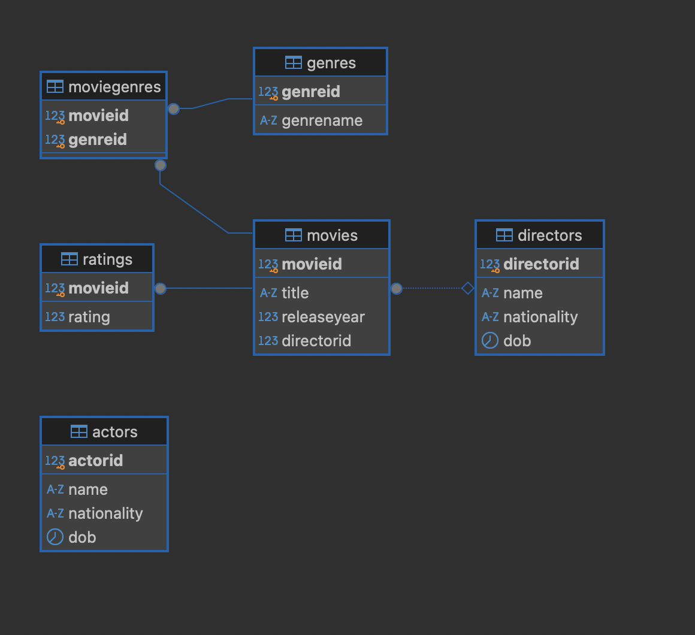

# Movie Database API

This is a TypeScript Node.js application that provides a RESTful API for managing a movie database. The database consists of tables for directors, actors, genres, movies, and ratings.

## Database Diagram

Below is the database diagram illustrating the relationships between the tables:



## Features

- CRUD operations for directors, actors, genres, movies, and ratings.
- Many-to-many relationship management between movies and genres.
- Database migrations using TypeScript.

## Scripts

The following scripts are available in the project:

- **install**: INstall dependencies.
  ```bash
  npm install

- **migrate**: Runs migrations.
  ```bash
  npm run migrate

- **start**: Runs the application.
  ```bash
  npm start

- **run**: Runs the application in watch mode.
  ```bash
  npm dev

# Run using Docker
- **run**: Runs the application in watch mode.
  ```bash
  docker-compose up
